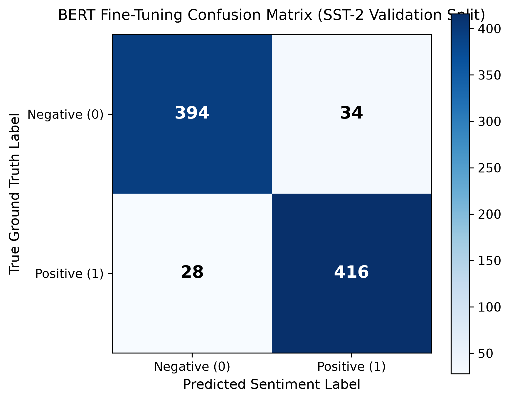

# Support-Ticket Sentiment Classifier

A sentiment classification system designed to analyze and classify customer support tickets into positive and negative sentiments.

---

## Project Overview: BERT Fine-Tuning vs. TF-IDF Baseline

This repository compares two distinct sentiment classification paradigms on the official **GLUE SST-2 (Stanford Sentiment Treebank)** benchmark:
1. **TF-IDF + Logistic Regression:** Classical n-gram bag-of-words baseline.
2. **BERT Fine-Tuning (`bert-base-uncased`):** Pretrained bidirectional transformer fine-tuned for sequence classification.

---

## Tech Stack

- **Frontend:** Next.js (App Router), React, JavaScript, Tailwind CSS, Axios, Lucide Icons
- **Backend:** Python 3.11, FastAPI, Uvicorn, Pydantic
- **Machine Learning & NLP:**
  - Hugging Face `transformers` (`bert-base-uncased`, `Trainer`, `TrainingArguments`)
  - Hugging Face `datasets` (Official GLUE SST-2)
  - Hugging Face `accelerate` (Hardware & GPU execution)
  - `torch` (PyTorch with CUDA 12.4 acceleration)
  - `scikit-learn` (TF-IDF Vectorizer, Logistic Regression, Evaluation Metrics)
  - `matplotlib` (Confusion matrix visualization)

---

## Folder Structure

```
support-ticket-sentiment-classifier/
│
├── frontend/                     # Next.js frontend project (React, JS, Tailwind CSS, Axios)
├── backend/                      # FastAPI backend project (main.py, requirements.txt)
├── data/                         # Dataset storage and scripts
│   ├── sst2/                     # Official SST-2 GLUE benchmark dataset splits (train, validation)
│   └── download_sst2.py          # Script to download official SST-2 dataset
├── models/                       # Model weights storage and scripts
│   ├── bert/                     # Pretrained BERT base weights and tokenizer config/vocab
│   ├── bert-sst2/                # Fine-tuned BERT model weights, tokenizer & config
│   └── download_bert.py          # Script to download pretrained BERT & tokenizer
├── training/                     # Model training notebooks & experiment pipelines
│   └── bert_finetuning.ipynb     # Complete BERT fine-tuning & evaluation notebook
├── evaluation/                   # Evaluation artifacts and figures
│   └── figures/                  # Evaluation plots (confusion matrices, ROC curves)
│       └── bert_confusion_matrix.png
├── docs/                         # Project documentation
├── tests/                        # Automated tests
├── requirements.txt              # Core project dependencies (Transformers, Torch, Scikit-Learn)
├── .gitignore                    # Git ignore rules for venv, node_modules, datasets, weights
└── README.md                     # Project overview, setup, and run instructions
```

---

## Environment Setup

### 1. Python Virtual Environment

```bash
# Windows PowerShell
python -m venv .venv
.\.venv\Scripts\Activate.ps1

# Linux / macOS
python -m venv .venv
source .venv/bin/activate
```

### 2. Install Project Dependencies

```bash
pip install -r requirements.txt
```

*For GPU acceleration (NVIDIA GPU with CUDA 12.4):*
```bash
pip install torch --index-url https://download.pytorch.org/whl/cu124
```

---

## BERT Fine-Tuning Experiment

The fine-tuning pipeline is implemented in [`training/bert_finetuning.ipynb`](training/bert_finetuning.ipynb) and consists of 13 structured sections:

1. **Imports:** Loads PyTorch, Hugging Face Transformers, Datasets, Scikit-Learn, and Matplotlib.
2. **GPU Check:** Detects GPU device, CUDA availability, and enables TF32 / Mixed Precision (`fp16`).
3. **Load SST-2:** Loads official GLUE SST-2 splits (`train`: 67,349, `validation`: 872) without custom splits.
4. **Dataset Inspection:** Analyzes label distributions and inspects sample texts.
5. **Load Pretrained BERT:** Loads `bert-base-uncased` with `AutoModelForSequenceClassification` (`num_labels=2`).
6. **Tokenization:** WordPiece tokenization with `max_length=128`, `truncation=True`, and dynamic batch padding via `DataCollatorWithPadding`.
7. **Training Configuration:** Hugging Face `TrainingArguments` (`learning_rate=2e-5`, `weight_decay=0.01`, `load_best_model_at_end=True`, `eval_strategy="epoch"`).
8. **Fine-Tuning:** Updates pretrained encoder weights and classification head using SST-2 training data.
9. **Evaluation:** Evaluates strictly on the official SST-2 validation split (Accuracy, Precision, Recall, F1, Classification Report).
10. **Confusion Matrix:** Renders and saves [`evaluation/figures/bert_confusion_matrix.png`](evaluation/figures/bert_confusion_matrix.png).
11. **Save Model:** Serializes model, tokenizer, and config to [`models/bert-sst2/`](models/bert-sst2/).
12. **Inference Test:** Runs predictions and confidence scores on support-ticket text examples.
13. **Results:** Prints final metrics and comparison matrix.

---

## Empirical Benchmark Results

Evaluated on the official **SST-2 validation split (872 sentences)**:

### 1. Comparison Table (Actual Empirical Metrics)

| Model | Accuracy | Precision | Recall | F1 Score |
| :--- | :---: | :---: | :---: | :---: |
| **TF-IDF + Logistic Regression** | 0.8131 | 0.7933 | 0.8559 | 0.8234 |
| **BERT Fine-Tuned (`bert-base-uncased`)** | **0.9289** | **0.9244** | **0.9369** | **0.9306** |

### 2. BERT Classification Report

```text
              precision    recall  f1-score   support

Negative (0)     0.9336    0.9206    0.9271       428
Positive (1)     0.9244    0.9369    0.9306       444

    accuracy                         0.9289       872
   macro avg     0.9290    0.9287    0.9289       872
weighted avg     0.9290    0.9289    0.9289       872
```

### 3. Confusion Matrix



- **True Negatives:** 394
- **False Positives:** 34
- **False Negatives:** 28
- **True Positives:** 416

### 4. Support-Ticket Inference Samples

| Customer Support Sample | Predicted Sentiment | Confidence | Probabilities (Neg / Pos) |
| :--- | :---: | :---: | :---: |
| *"The support team solved my problem quickly."* | **POSITIVE** | **77.69%** | `[0.2231, 0.7769]` |
| *"The issue was never fixed and the service was terrible."* | **NEGATIVE** | **99.69%** | `[0.9969, 0.0031]` |
| *"I appreciate the prompt resolution, exceptional customer care!"* | **POSITIVE** | **99.92%** | `[0.0008, 0.9992]` |
| *"My ticket was closed without any explanation or refund."* | **NEGATIVE** | **97.65%** | `[0.9765, 0.0235]` |

---

## Dataset & Domain Limitation Disclosure

> **Scientific Transparency & Domain Mismatch:**
> - The SST-2 dataset consists of single-sentence movie reviews from Rotten Tomatoes.
> - While SST-2 is the recognized academic benchmark for evaluating NLP sequence classification pipelines, customer support tickets exhibit distinct domain characteristics (technical logs, billing disputes, frustration indicators, mixed bug descriptions and polite sign-offs).
> - Performance on SST-2 demonstrates the sentiment classification pipeline and transfer learning capability, but does not establish production performance on real-world support-ticket data without domain-specific data fine-tuning or evaluation.

---

## Running the Application

### 1. Run the Training Notebook

Open and run all cells in [`training/bert_finetuning.ipynb`](training/bert_finetuning.ipynb) via VS Code, JupyterLab, or Google Colab.

### 2. Run Backend Server

```bash
# Windows PowerShell
.\.venv\Scripts\uvicorn backend.main:app --reload --port 8000
```

- Health Endpoint: [http://127.0.0.1:8000/api/v1/health](http://127.0.0.1:8000/api/v1/health)
- Interactive Docs: [http://127.0.0.1:8000/docs](http://127.0.0.1:8000/docs)

### 3. Run Frontend Server

```bash
cd frontend
npm install
npm run dev
```

- Web UI: [http://localhost:3000](http://localhost:3000)
